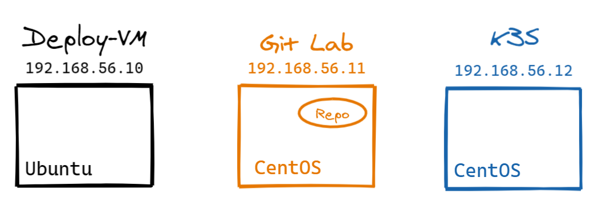

# About
Date : 01 Nov 2020  
Author: Lionel Gurret
Description : Install quickly VMs with Vagrant on VirtualBox !
# LinkedIn article related
# Prerequisites
* Install Oracle Virtual Box  
* Install Vagrant
# How to launch the Lab
Download the code  
Go to this directory and run :  
`vagrant up`  
Then, run the following command to get ssh config to reach your VMs :  
`vagrant ssh-config`  
  
