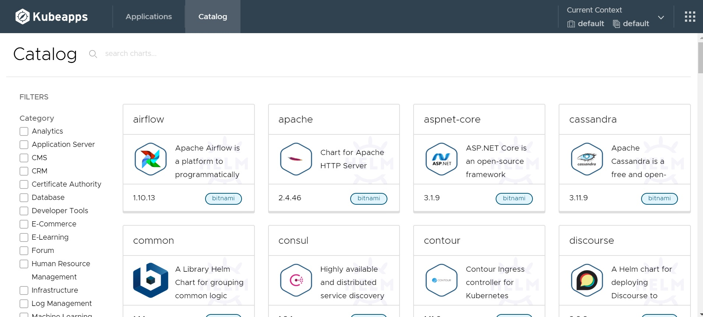

# About
Date : 10th Dec 2020  
Author: Lionel Gurret  
Description : Kubeapps Demo - Learn how to deploy Helm charts through a web interface !
# LinkedIn article related
TO COMPLETE
# Prerequisites
This script is designed for Minikube !  
(https://kubernetes.io/fr/docs/tutorials/hello-minikube/ - Click on Launch Terminal)
# How to run the lab
`git clone https://github.com/gurretl/labs.git`  
`cd labs/Lab-07`  
`./run.sh`  

You can now install apps through Kubeapps :
  

