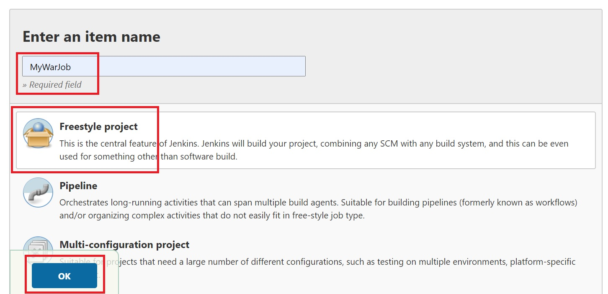

# About
Date : 22th Dec 2020  
Author: Lionel Gurret  
Description : Deploy Sample war application on Tomcat using Jenkins
# Prerequisites
This script is designed for Minikube !  
(https://kubernetes.io/fr/docs/tutorials/hello-minikube/ - Click on Launch Terminal)  
# How to run the lab
`git clone https://github.com/gurretl/labs.git`  
`cd labs/Lab-11`  
`./run.sh`

# Manual actions
Once your environment is setup, go to Jenkins and do the following :
* Unlock Jenkins using the unlock key
* Install default plugins
* Create a Jenkins user
* Accept Jenkins default URL

Then, you need to install a plugin in order to deploy a war file in Tomcat.  
Go to Manage plugins :  
    

Add the following plugin :  
  

Now we will create a new job for our task :  
  

Create the following job :  
  

Add this repository as SCM :  
  

Choose to connect only to this subdirectory :  
  

Configure the following :  
  

Add a Build step :  
  

Configure the container as so (create a new user deployer by clicking on Add with the same password as in our Helm chart) :  
  

Save and run the job by clicking on :  
  

Your app is deployed, you should see it at the following URL https://TOMCAT_URL/sample :  
  
