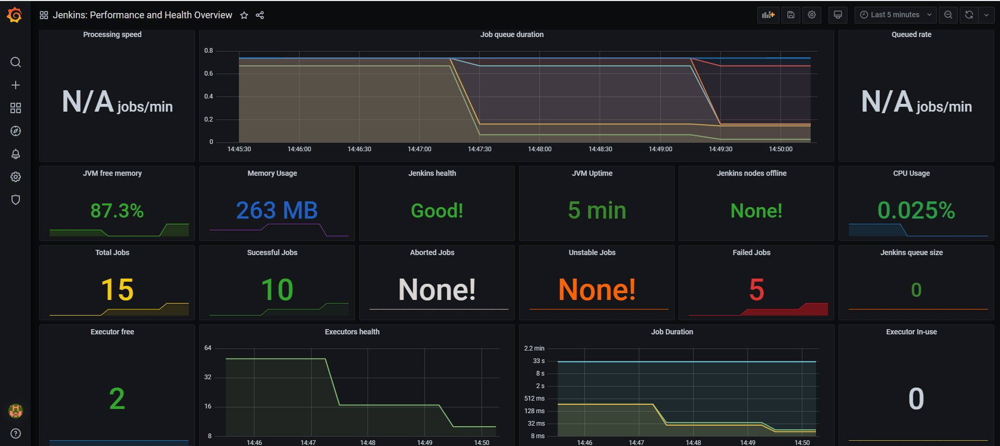

# About
Date : 23th Dec 2020  
Author: Lionel Gurret  
Description : Scrap Jenkins with Prometheus and display informations in Grafana
Note : Inspired by https://medium.com/@eng.mohamed.m.saeed/monitoring-jenkins-with-grafana-and-prometheus-a7e037cbb376  
and https://joostvdg.github.io/blogs/monitor-jenkins-on-k8s/introduction/    
Thanks a lot guys you helped me a lot !
# LinkedIn article related
TO COMPLETE
# Prerequisites
This script is designed for Minikube !  
(https://kubernetes.io/fr/docs/tutorials/hello-minikube/ - Click on Launch Terminal)
# How to run the lab
`git clone https://github.com/gurretl/labs.git`  
`cd labs/Lab-12`  
`./run.sh`  
* Wait some time to let Jobs ru
* Go to Grafana and look at this nice dashboard :)  
  
