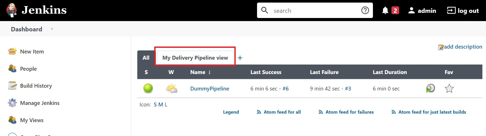
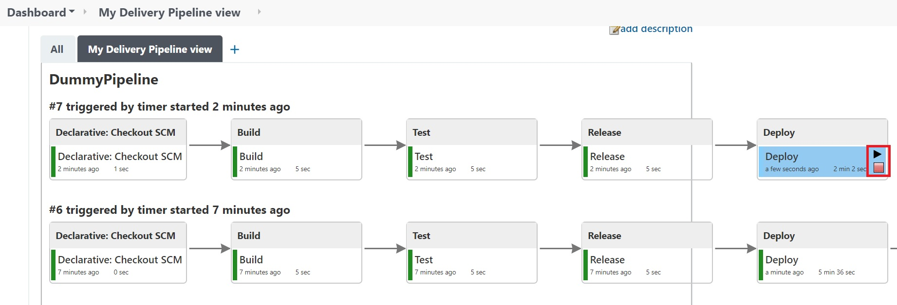
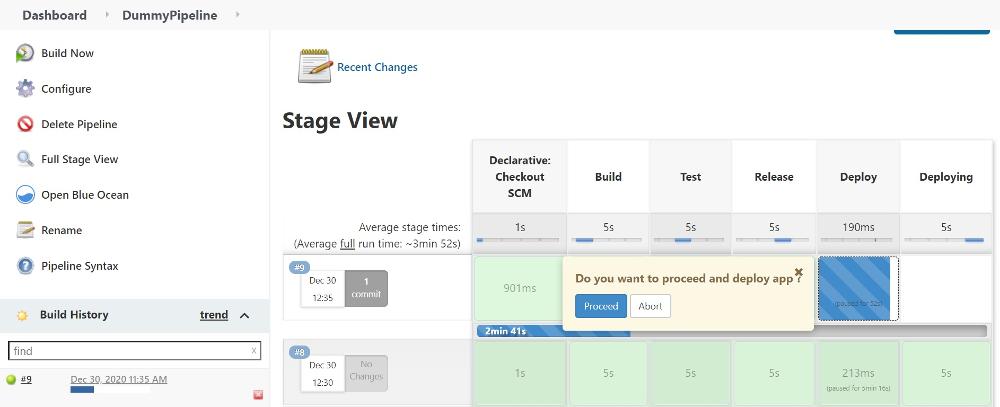

# About
Date : 30th Dec 2020  
Author: Lionel Gurret  
Description : Deploy Jenkins with a dummy CI/CD Pipeline
* Install Jenkins in Minikube
* Add jobs in Jenkins
* Add a delivery Pipeline

# LinkedIn article related
TO COMPLETE
# Prerequisites
This script is designed for Minikube !  
(https://kubernetes.io/fr/docs/tutorials/hello-minikube/ - Click on Launch Terminal)
# How to run the lab
`git clone https://github.com/gurretl/labs.git`  
`cd labs/Lab-13`  
`./run.sh`  
* Go to Jenkins web interface a check and play with jobs and delivery pipeline created
  
You can accept or deny the manual action which will virtually deploy your application from the pipeline view :  
  
Or directly from the Job view :  
  

