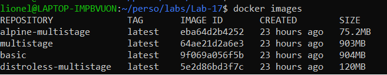

# About
Date : 09 Mar 20201
Author: Lionel Gurret  
Description : Compare Docker Images Size  
# LinkedIn article related
# Prerequisites
Get a Docker environment.  
I.e : You can use something like : https://labs.play-with-docker.com/
# How to launch the Lab
`git clone https://github.com/labs`  
`cd labs/Lab-17`  
`./run.sh`  
  
