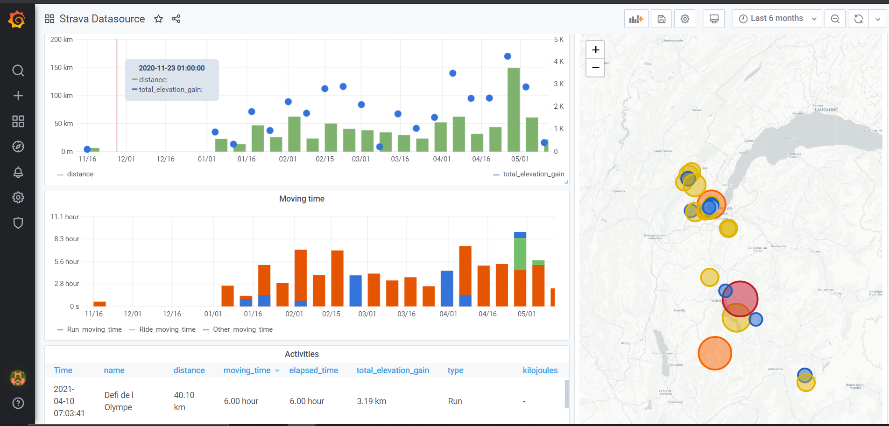
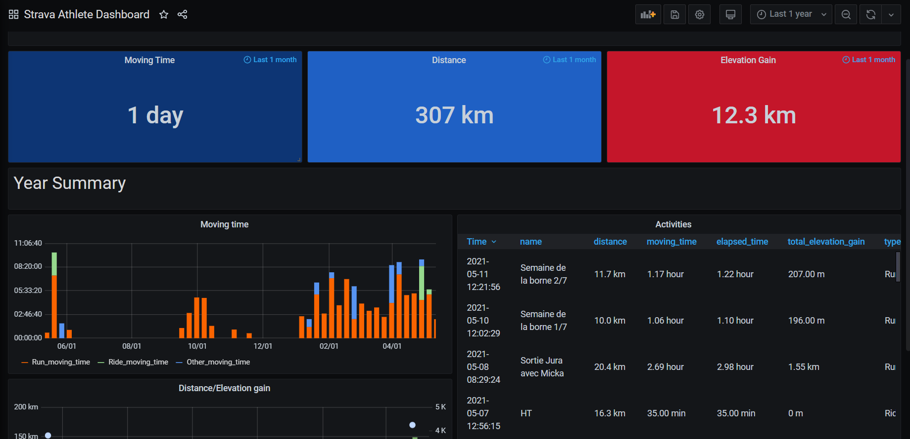
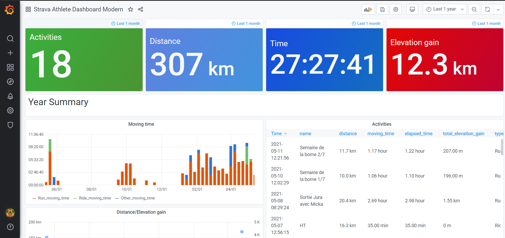

# About
Date : 18th Nov 2020  
Author: Lionel Gurret  
Description : Install Prometheus / Grafana Stack on Hello Minikube with Helm !  
* Install Grafana on Minikube using Helm
* Configure Grafana with Strava plugin
# LinkedIn article related
# Prerequisites
This script is designed for Minikube !  
(https://kubernetes.io/fr/docs/tutorials/hello-minikube/ - Click on Launch Terminal)  
Check this article if facing the same bug : https://github.com/grafana/strava-datasource/issues/2
# How to run the lab
`git clone https://github.com/gurretl/labs.git`  
`cd labs/Lab-03`  
`./run.sh`
Then go to Grafana and follow the following documentation https://github.com/grafana/strava-datasource/blob/master/docs/configuration.md
  
 
  

